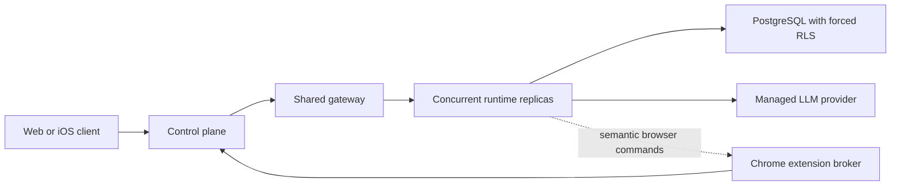

# Concurrent Multi-Tenant Runtime Service

The concurrent runtime is an opt-in, chat-only execution tier in which one
replica can process turns for many organizations and assistants at the same
time. It creates logical assistant state in shared PostgreSQL storage instead
of provisioning a Railway service and volume for every eligible assistant.

This tier does not switch a process-global assistant ID, workspace, current
directory, environment, or SQLite connection. Every request carries an
immutable tenant context and every durable query is scoped by organization and
assistant.

## Topology



The control plane remains the public API edge. It authenticates assistant
ownership and signs a short-lived actor token containing organization, user,
assistant, actor, and request identities. The shared gateway runs with
`RUNTIME_ASSISTANT_SCOPE_MODE=tenant_context`, verifies that the URL, token,
and canonical tenant headers agree, exchanges the token for the runtime
audience, and rewrites assistant-scoped URLs to flat runtime routes.

The runtime rejects pooled-worker leases, gateway service authority, missing
tenant claims, mismatched headers, subject mismatches, and insufficient
scopes.

Managed-model inference is available only inside the validated request-local
tenant context. The shared process does not switch a global assistant ID,
read personal provider credentials, or cache a key-bearing adapter across
requests. A company-owned provider key is stored only in the service's secret
environment; tenant identity is carried separately in usage attribution.

## Supported Contract

The first deployment slice supports:

- `POST /v1/messages`;
- `GET /v1/messages?conversationId=...`;
- `GET /v1/conversations` and `GET /v1/conversations/:id`;
- `GET /v1/events` with durable replay and heartbeat frames;
- `POST /v1/conversations/:id/cancel`;
- opt-in Chrome extension browser broker routes under
  `/v1/browser-broker/*` plus
  `/v1/conversations/:id/browser-access` when the broker feature is enabled;
- read-only web bootstrap endpoints for identity, authentication status,
  configuration, provider-connection status, pending interactions, home feed,
  and disk-pressure status;
- `/health`, `/healthz`, and `/readyz`.

Messages are accepted idempotently, return `202`, and are executed through a
fair global/per-tenant scheduler. Turns for one conversation serialize while
different conversations can run concurrently. Retrying the accepted request
with the same idempotency key reclaims queued runs and processing runs whose
lease expired. SSE subscribers that cannot keep up are shed with structured
logging and Sentry reporting instead of growing an unbounded in-memory buffer.

Conversation summaries and details are derived from the same tenant-scoped
PostgreSQL transcript and never read process-global workspace state. Empty
bootstrap responses advertise only capabilities the concurrent tier actually
implements.

All other `/v1/*` routes return `requires_dedicated_runtime`. Attachments,
onboarding bootstrap payloads, slash commands, personal provider credentials,
custom model endpoints, workspace operations, memory, tools, schedules,
channels, voice, unrestricted host access, raw Chrome DevTools Protocol access,
and long-lived local processes remain dedicated runtime capabilities.

## Conversation-Scoped Browser Broker

`CONCURRENT_BROWSER_BROKER_ENABLED=true` adds a bounded browser tool to the
concurrent model loop. It is disabled by default and advertised in health
capabilities only while enabled. `CONCURRENT_BROWSER_ALLOWED_ORIGINS` is a
comma-separated list of canonical HTTPS origins such as
`https://example.com`; navigation is denied when the origin is absent. A
conversation must also have an explicit grant for one connected extension
installation before the model receives the tool.

Every connection, grant, session, command, receipt, and result carries the
exact organization, assistant, user, actor, conversation, client, connection,
and generation scope applicable to it. The server stores only a hash of the
rotating connection credential. A resumed connection rotates that credential;
a fresh connection supersedes the previous generation and invalidates its tab
sessions. The event stream is independent of chat SSE and supports replay from
its durable sequence cursor.

The wire contract exposes reviewed semantic operations only: open or close the
leased tab, navigate, snapshot, screenshot, click or type through current
snapshot references, press an allowlisted key, scroll, select an option, wait,
and query status. It never exposes browser tab identifiers, arbitrary
JavaScript, raw CDP methods, cookies, credentials, downloads, uploads, browser
settings, localhost, private-network targets, or non-HTTPS navigation.

The extension opens a new tab rather than adopting an arbitrary existing tab.
It maintains an opaque tab lease, document epoch, and short-lived element
references. Password, payment, one-time-code, and similarly sensitive inputs
are refused. Its action journal deduplicates replayed commands; a replayed
non-idempotent action that was executing without a durable terminal result is
reported as `unknown_outcome` instead of being guessed or repeated. The popup
offers immediate human takeover and resume controls, clears snapshot leases on
every ownership transition, and displays whether the agent or user owns the
tab.

Provider responses and browser results are persisted as ordered run steps.
While an action is outstanding the run is parked as `waiting_for_browser`, so
the worker lease is not held and later turns in that conversation remain
ordered. A terminal browser result appends the matching tool result, returns
the run to the queue, and resumes inference without relying on replica-local
state. Run-step payloads and outbox bodies are deleted when the run reaches a
terminal state; action rows retain hashes and coarse state while URL, typed
input, page content, screenshots, and result bodies are redacted.

## Persistence And Isolation

`assistant/src/concurrent-runtime/` owns the stateless execution kernel and
PostgreSQL repository. `@vellumai/service-contracts/tenant-context` owns the
versioned tenant claim and execution-context schemas.

The append-only migrations create:

- tenant-scoped assistant, conversation, message, run, and event tables;
- compound ownership primary/foreign keys;
- tenant-scoped idempotency uniqueness;
- ordered transcript positions;
- run leases and fencing;
- durable event sequence indexes;
- enabled and forced row-level security on every tenant table.

Migration 2 additionally writes immutable user/actor ownership onto new
conversations and creates actor-scoped browser clients, connection
generations, conversation grants, tab sessions, run steps, action journal, and
outbox tables. Legacy conversations whose owner columns are null retain their
existing assistant-scoped visibility; browser access cannot be granted until
the conversation has an exact user/actor owner.

Repository operations require an explicit `TenantExecutionContext`, set
transaction-local PostgreSQL tenant settings, and include explicit
organization and assistant predicates even though RLS is also active.

The application database role must not have `BYPASSRLS`. Run migrations with
a separate migration role through
`CONCURRENT_RUNTIME_MIGRATION_DATABASE_URL` when the application role cannot
perform DDL.

## Placement

Concurrent placement is disabled by default. The control plane accepts:

```text
WORKLIN_CONCURRENT_RUNTIME_MODE=disabled|internal|canary|new_assistants
WORKLIN_CONCURRENT_RUNTIME_GATEWAY_URL=http://<shared-gateway>:<port>
WORKLIN_CONCURRENT_RUNTIME_ASSISTANT_IDS=assistant-123,assistant-456
WORKLIN_CONCURRENT_RUNTIME_USER_IDS=user-123,user-456
```

`internal` and `canary` require a matching assistant or user allowlist entry.
`new_assistants` assigns every newly created runtime stack to the concurrent
service. Existing allocated runtime-stack rows are never converted by changing
these variables. An eligible failed or provisioning Railway row that has no
service, volume, or gateway allocation is recovered in place when allowlisted.
Migration between allocated providers requires a separate fenced data
migration.

An eligible stack is created immediately with:

```json
{
  "provider": "concurrent_service",
  "status": "active",
  "service_ref": "concurrent-runtime",
  "workspace_volume_ref": null
}
```

Disabling placement stops new assignments. It does not invalidate assistants
already stored on the concurrent tier; draining or migrating those assistants
is an explicit operation.

## Service Configuration

Deploy the combined runtime image with:

```text
WORKLIN_RUNTIME_MODE=concurrent_service
RUNTIME_ASSISTANT_SCOPE_MODE=tenant_context
CONCURRENT_RUNTIME_DATABASE_URL=<application PostgreSQL URL>
CONCURRENT_RUNTIME_MIGRATION_DATABASE_URL=<optional migration PostgreSQL URL>
ACTOR_TOKEN_SIGNING_KEY=<shared 64-hex control-plane signing key>
CONCURRENT_RUNTIME_MANAGED_PROVIDER=<catalog provider id>
CONCURRENT_RUNTIME_MANAGED_MODEL=<optional model id; defaults to provider default>
<PROVIDER_API_KEY_ENV>=<company-owned managed inference key>
```

`WORKLIN_PLATFORM_ASSISTANT_ID` must be unset. The entrypoint starts the
gateway, CES, and concurrent HTTP kernel, and does not start the
single-tenant assistant process.

Optional tuning variables:

```text
CONCURRENT_RUNTIME_DATABASE_MAX_CONNECTIONS=20
CONCURRENT_RUNTIME_MAX_CONCURRENT_TURNS=32
CONCURRENT_RUNTIME_MAX_CONCURRENT_TURNS_PER_TENANT=2
CONCURRENT_RUNTIME_LEASE_DURATION_MS=600000
CONCURRENT_RUNTIME_EVENT_POLL_INTERVAL_MS=250
CONCURRENT_BROWSER_BROKER_ENABLED=false
CONCURRENT_BROWSER_ALLOWED_ORIGINS=https://example.com
CONCURRENT_RUNTIME_PORT=3001
CONCURRENT_RUNTIME_HOST=0.0.0.0
```

Database URLs and signing keys are secrets. Keep them in the deployment secret
manager and never place them in a workspace, browser variable, run record, or
log.

## Release Gates

The code path is suitable for local and non-production canaries. Production
traffic remains gated until all of the following pass against managed
infrastructure:

1. PostgreSQL integration tests prove RLS isolation and connection-pool claim
   reset with separate migration and application roles.
2. Interleaved multi-tenant, cancellation, reconnect, replica-crash, and load
   tests find no cross-tenant rows or events.
3. At least 50 simultaneous turns meet the agreed latency, queue, memory,
   database-pool, and provider-rate SLOs.
4. Backup, restore, deletion, kill-switch, drain, and rollback drills pass.
5. Security review approves the token, RLS, logging, and shared-gateway
   boundaries.
6. Each additional capability receives its own concurrent-safety review before
   entering the allowlist.

Dedicated and leased pooled runtimes remain the fallback for unsupported
capabilities.
